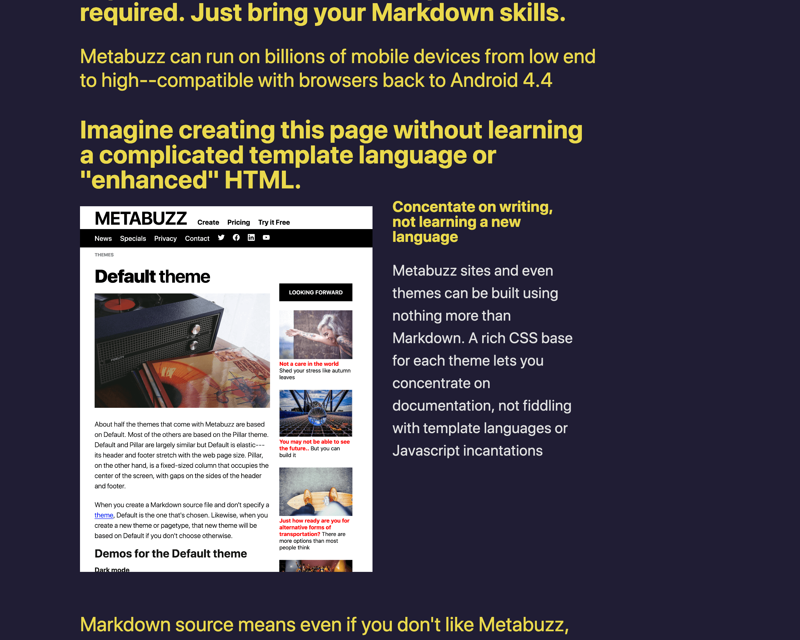
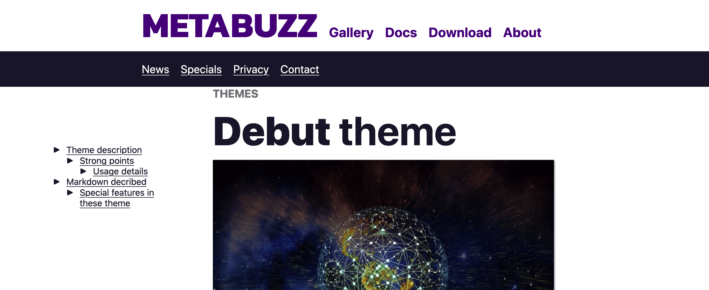

===
theme="debut"
sidebar="left"
===

# How to use the Debut theme

Debut makes an impact. It's supposed to cut through the visual clutter, and has a few features to make that happen easily.

## Header

The header expects you to create a unordered list of links. In return you get special branding on the first one. When you look at the [header file](../../docs/header.html)

## Typography

### Start of page only: Follow first h1 with an h2

To get a huge impact with headlines, start your page using Markdown following an h2 immediateily after an h1:

```markdown
# Top headline
## Second-level headline immediately after
```

The h2 is huge, though isolated h2s in the rest of the document won't be. This is the kind of thing to use on a home page only, and just once.

## Images

Images are normally large, taking up most of the article width, but there are some exceptions:

* Following an H2, you can display an image with text on the right. See below for details.
* Following an H3, you can display an image floating to the right, with text to its left. See below for details.
 
### Displaying image on left with text to the right 

To describe what's going on adjacent to an image, you start with an H2, then use a bullet point with an image title. It's meant to be used with an H3 that appears to the right of the image, then normal paragraph following it. Then the next header starts a new line. Here's an example:

```markdown
## H2 over image
* 
  ### Follow with exactly 2 spaces, then an optional H3
  Or exactly 2 spaces, and normal text
```
## H2 over image
* 
  ### Follow with exactly 2 spaces, then an optional H3
  Or exactly 2 spaces, and normal text

#### Special notes

* Ensure that under the bullet with the image link you indent exactly two spaces

### Displaying an image on right with text to the left

```markdown
### H3 over image that floats to the right

Any text follows; image floats to its left. 
``` 
### H3 over image that floats to the right

Any text follows; image floats to its left. 

## Sidebar

### Show links in outline style

This theme provides the unordered list style with 3 distinct outline levels in the sidebar:

```
* How to use the Debut theme
  + Typography
    - Start of page only: Follow first h1 with an h2
  + Images
    - Displaying image on left with text to the right 
```




### Change the sidebar bullet character

The sidebar uses a special triangle character for its top-level bullets. You can change it by replacing the character as shown in either [theme-light](themes.html#light-and-dark-themes)
```html
--sidebar-bullet: '▶';
```
