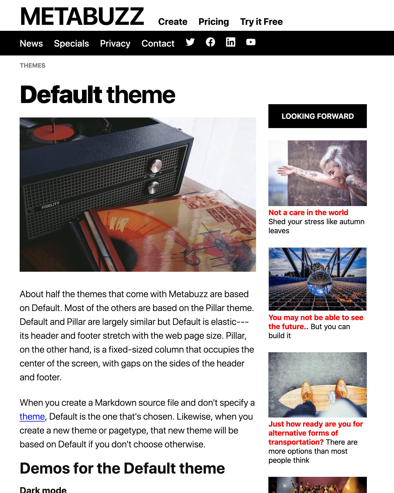

<a id="how-to"></a>

# The Debut Home pagetype punches you right in the face using a special trick. 

## If you follow an H2 right after an H1 as we've done here, the H2 is shown much more prominently than in later usage. It happpens only this once.


## Build fast static websites without being an expert at static websites, no special tools required. Just bring your Markdown skills.

### Metabuzz can run on billions of mobile devices from low end to high--compatible with browsers back to Android 4.4

## Imagine creating this page without learning a complicated template language or "enhanced" HTML.
* 
  ### Concentate on writing, not learning a new language
  Metabuzz sites and even themes can be built using nothing more than Markdown. A rich CSS base for each theme lets you concentrate on documentation, not fiddling with template languages or Javascript incantations

### Markdown source means even if you don't like Metabuzz, your time wasn't wasted

You can make a complete pilot test site using only the Markdown skills you already  have. Don't like Metabuzz? You can still use everything you wrote on another static site platform.

### All themes have built-in dark mode

The themes that come with Metabuzz separate layout and typography from color by splitting stylesheets. 

#### Q: What's the difference between these two themes? 
* 

* 

#### A: One line of code:

Add `mode="light"` (the default) or `mode="dark"` to your front matter and boom, dark mode.

```
===
mode="dark"
===
```


## Metabuzz converts your words and pictures into websites with no setup and no configuration needed. Just get words on a page, supply the pictures, and Metabuzz does the rest. Batteries included.

Building structured websites fast using Markdown sounds compelling
until you try the other static site generators. 
Suddenly you find out that just to get a quick test site running
you need to be an expert on Javascript and npm,
static site generators, package management, Ruby, or 
advanced CSS/HTML.

### Mobile-first, responsive, and compatible with just about _everything_

Metabuzz sites look state of the art, but they'll run fine on mobile browsers going back several generations. All included themes are responsive. It comes with a variety of fully-documented themes, but you're welcome to roll your own.

## Build fast, run faster

Metabuzz generates most sites in a second or two.

## Perfect for rural areas and developing countries


The templates that ship with Metabuzz are highly optimized HTML compatible
with virtually all mobile devices, dating back to at least Android 4.4.
That means Metabuzz sites render beautifully on even the oldest mobile devices.
More important, it means that they keep bandwidth and therefore data
costs to a minimum--something appreciated by audiences in rural
areas and developing countries.

Metabuzz sites look great, but they're extraordinarily light on resource usage. Many, many users in the USA are held back by slow web access and expensive data plans. It's even worse many other countries. Some complete Metabuzz sites are smaller than a single image created using less thoughtful platforms.

## A toolchain with just one tool and no dependencies

Metabuzz consists of a single executable file and some themes. That's it. It makes judicious use of standard HTML and CSS variables, so you don't have to learn SASS or LESS.

## Opposites

Most static site generators think you already know a lot about Ruby, Javascript, CSS preprocessors, and using complicated template languages.

Metabuzz takes the opposite approach. It assumes you are more interested in getting a useful, SEO-ready, high-performance website than you are in learning a new
programming language just to get some HTML published. (Don't worry---if you like complicated template languages
Metabuzz has one, but you don't need to learn it if you don't want to.)

## Javascript not required

No Metabuzz templates require Javascript out of the box,
though some can use it for incremental search. This makes your
sites friendly to security-conscious readers.
Of course, Metabuzz templates are comprised of Markdown, HTML and CSS,
nothing prevents you from using Vue.js, React, or any other Javascript
components.


## Where do Metabuzz-generated sites fit best?

Wondering how Metabuzz fits into your workflow?

* **Busy creators** Consider Metabuzz seriously if you're generating more than a few
pages of technical documentation a week, blogging frequently, or maintaining
a production news or aggregation site.
* **Audiences on a budget** Metabuzz shines where speed and bandwidth costs are important, especially in developed countries. Metabuzz generates tiny, Javascript-free sites by default, saving huge amounts in bandwidth and decreasing site churn
* **Accessibility concerns** Users with visual impairments welcome Metabuzz sites because the pure HTML approach means Metabuzz sites are easily accessible to screen readers and font size adjusment

