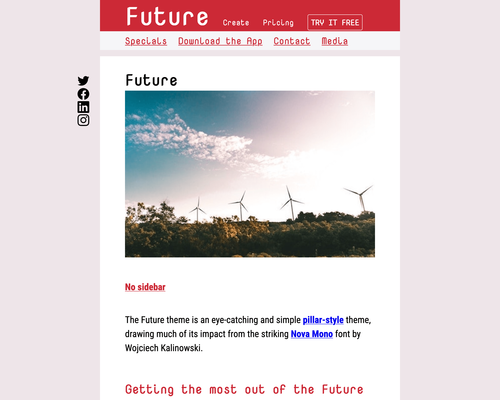

===
theme="debut"
pagetype="gallery"
sidebar="none"

[List]
Title="METABUZZ THEME GALLERY"
DemoTheme="FUTURE"
===

# **{{ .FrontMatter.List.DemoTheme }}** theme
* 
  ### {{ if .FrontMatter.List.DemoPageType }} PageType: **{{ .FrontMatter.List.DemoPageType }}**{{ else }}### {{ end }}
  The Future theme is an eye-catching and simple [pillar-style](../pillar/index.html) theme, drawing much of its impact from the striking [Nova Mono](https://fonts.google.com/specimen/Nova+Mono) font by Wojciech Kalinowski.
  ### Modes
  [Light theme](demo/index.html) [Dark theme](demo/dark.html)
  ### Sidebar support
  Light theme: [Left](demo/light-sidebar-left.html) [Right](demo/light-sidebar-right.html)  
  Dark theme: [Left](demo/dark-sidebar-left.html) [Right](demo/dark-sidebar-right.html) 
  #### CREATOR [Tom Campbell](https://metabuzz.com)
  #### LICENSE [MIT](https://metabuzz.com)
  ### Next: [Journey](../journey/index.html) 

