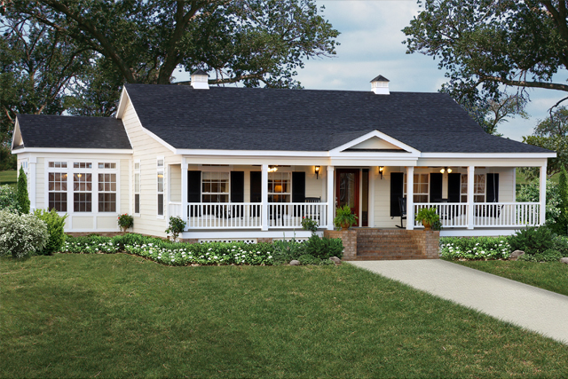
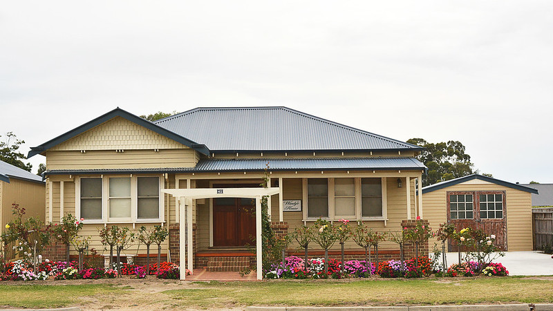
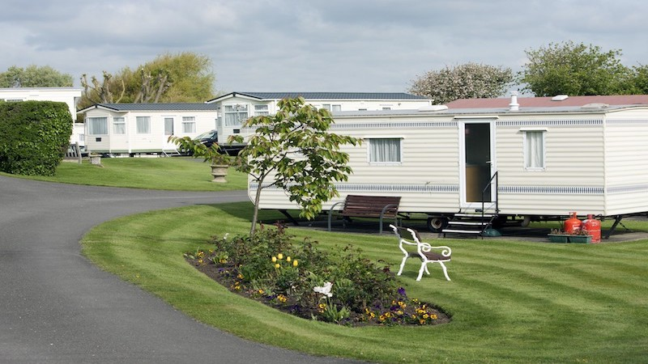

===
theme="journey"
sidebar="right"
description="Landsteading blog page"
===

# How to Build a Modular Home 

#### Photo credit: [Willow Exterior Shoot by Brent Allison](https://en.wikipedia.org/wiki/File:Willow-Exterior.jpg)

What is the difference between manufactured homes/ mobile homes and modular homes, I hear you cry. (Okay, maybe you didn’t cry, but I bet you were curious.) Well, my stellar reader, the main difference is that a manufactured home is built to federal building codes whereas a modular home is built to state or local building codes. Mobiles homes also don’t have to be built on foundations. 

That being said, both modular homes and mobile homes are built in a factory. Therefore, they materials are also not damaged by the weather. Mobile homes have less customization since they are built to be a quick housing solution. They are cheaper than buying a house on the market. 

I’ve seen mobile homes sell for $29,000, but that isn’t what they all cost. There is a wider price range, but definitely one of the less experience options. Do keep in mind that mobile homes tend to depreciate in value over time. 

## Modular Homes:

Here is a clearer breakdown for modular homes.

* Needs land to build on
* Needs a foundation which can cost around $5,000- $26,000
* Construction happens off site in a factory
* Average 4- 6 weeks to built
* Around $60- $150 per square foot
* Have to transport home to onsite 
* Limitations to height and width of the modules 
* Needs a crane to construct the house onsite
* Customizatizable 
* Is inspected at the factory 
* Construction loan same as a site built house
* Value does not depreciate over time

## Stick-Built Homes

Traditional or stick-built homes have a very different set of tradeoffs.

* Needs land to build on
* Construction happens onsite including foundation 
* Weather may affect construction
* Can take anywhere from 4- 12 months to construct 
* More customization e.g having a brick house
* Generally costs $150- $250 per square foot
* Cost of labor
* Cost of materials 
* Value does not depreciate over time 

## Houses on the Market:

An overview of traditional/stick-built homes:

* The median price of a house in America is $200,000
* Do note prices of houses vary depending on state and location. A house in Silicon Valley vs rural Iowa is very different.
* Median price is more applicable in rural parts of America 
* Zero customization when buying the house
* Value does not depreciate over time

## Manufactured homes/ Mobile homes

Don't forget mobile homes. The pros and cons are:

* No customization
* Less expensive
* No foundation required
* Value does depreciate over time 

# Final Thoughts
If you have land you are able to build on, then building a modular home is a great option. It has a good balance of pros and cons. It is a lot faster than building a standard stick-built home, though not as fast as a manufactured homes or straight up buying a house on the market. You are able to customize the house you want even if it’s not as much as the stick-built house, but still a lot more customizable than a manufactured home and one you buy off the market. 
  
A modular home is a good price range where it is generally less expensive than a stick-built house, more expensive than manufactured homes, and close to price to some on the market houses. It’s also awesome that a modular home does not depreciate its value over time. At the end of the day it’s really your decision to build one or not. Best of luck to you and your housing adventures!

### Links

[Cons to Modular homes](https://www.finelinehomes.com/biggest-problems-modular-homes/)  
[Pros and cons of a modular home](https://medium.com/@piotrgoawski/advantages-and-disadvantages-of-modular-homes-3592799ea)  
[Pros and cons of a modular home](https://www.maxrealestateexposure.com/pros-and-cons-of-modular-homes/)  
[Pros and cons of a modular home](https://www.modulartoday.com/pros-cons.html)  
[Cost](https://modularhomeowners.com/how-much-will-my-modular-home-cost/)  
[Video of a modular home being made](https://www.youtube.com/watch?v=tXUd-yUy0S0)  
[Definitions by government](https://web.archive.org/web/20160504145914/http://portal.hud.gov/hudportal/HUD?src=%2Fprogram_offices%2Fhousing%2Framh%2Fmhs%2Ffaq)   
[Wood vs brick](https://www.hunker.com/12000136/wood-vs-brick-house)  

---

## MORE ABOUT LANDSTEADING 
* 
  ### Masterpiece or Eyesore?
  #### Neighbors spar over controversial bungalow style 
  To some, it's a precious memory. To others, it's the house that shouldn't be there.
  [VIEW POST](/)
* 
  ### The Mobile Home Option 
  #### High Demand, or Just High Prices? 
  The ultimate "modular" home doesn't even need a foundation. But are rents worth it? 
  [VIEW POST](/)

