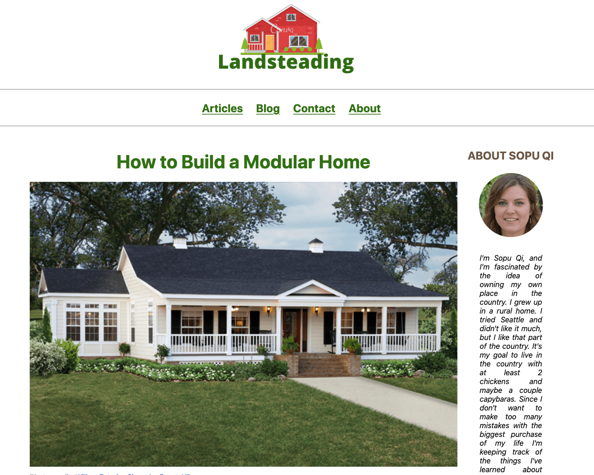

===
theme="debut"
pagetype="gallery"
sidebar="none"

[List]
Title="METABUZZ THEME GALLERY"
DemoTheme="JOURNEY"
#DemoPageType="HOME"
===

# **{{ .FrontMatter.List.DemoTheme }}** theme
* 
  ## {{ if .FrontMatter.List.DemoPageType }} PageType: **{{ .FrontMatter.List.DemoPageType }}**{{ else }}## {{ end }}
  Journey is an SEO-ready template for personal bloggers, with support for several kinds of image presentation.  
  ### Modes
  [Light theme](demo/index.html) 
  ### Sidebar support
  Light theme: [Left](demo/light-sidebar-left.html) [Right](demo/light-sidebar-right.html)  
  #### CREATOR [Tom Campbell](https://metabuzz.com)
  #### LICENSE [MIT](https://metabuzz.com)
  ### Next: [Pillar](../pillar/index.html) 

