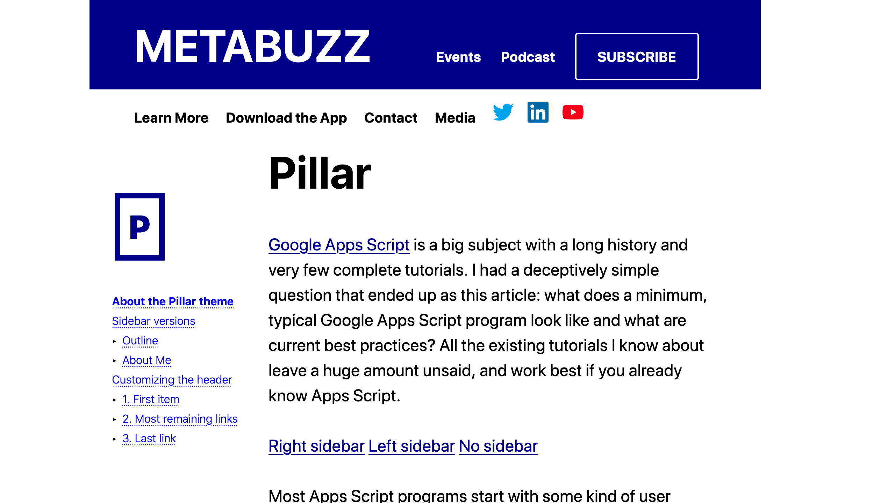

Pillar is the basis of about half of the Metabuzz themes. It gets its name 
from that fact that it stands in a column in the middle of the page, with 
gaps on the right and left sides.

This differs from the [Default](../default/index.html) theme, which is the basis
of most other Metabuzz themes. Default has a header and footer that stretch
to the ends of the page. Pillar themes reduce distraction because they tend to be 
less information dense, making it easier to focus on the article text. 
The default themes leave more room on the page for multiple kinds of content.

## Two shots

* 
  Here's some useful text
* 
  And more useful text
  

## Getting the most out of the {{ .FrontMatter.Theme }} theme

Pillar is mean to be a general-purpose theme with an eye toward
clean design and a minimum of surprises, but it does have a few
custom features:

## How this theme uses sidebars

### Test the {{ .FrontMatter.Theme }} with sidebars {#sidebars}

[Right sidebar](test-rside.html)
[Left sidebar](test-lside.html)
[No sidebar](index.html)

### 3-level outline format for sidebars {#outline}

Like the [Reference](../reference/index.html) theme, Pillar is
well suited for documentation. It employs a similar but not identical
way to show a table of contents in your document: by using unordered
lists to show up to 3 levels of outline. Your `sidebar.md` file
would look something like this:

```
* [About the Pillar theme](#Pillar)
  + [Sidebar versions](#sidebars)
    - [Outline](#outline)
    - [About Me](#about)
  + [Customizing the header](#customizing-header)
    - [1. First item](#first-link)
    - [2. Most remaining links](#most-links)
    - [3. Last link](#last-link)
```

And the resulting sidebar links would appear like this:


#### Note

This special formatting of unordered lists is restricted to sidebars. Don't worry that bullet lists won't look the way you expect in the document.

### Heavy box markdown for sidebars with strikeout syntax

Use a level 3 header within a sidebar (and no other part of the
document) to get a heavy box surrounding the text. It looks
great with just a single initial:


The markdown to accomplish that is `~~strikethrough~~` on a leavel 3 header, which normally
draws a line straight through the middle of the text, like this:

~~strikethrough~~

So, for example, you might want a sidebar that looks like this:


You'd put this markup into the sidebar:

```
~~P~~

* [About the Pillar theme](#Pillar)
  + [Sidebar versions](#sidebars)
    - [Outline](#outline)
    - [About Me](#about)
  + [Customizing the header](#customizing-header)
    - [1. First item](#first-link)
    - [2. Most remaining links](#most-links)
    - [3. Last link](#last-link)
```


