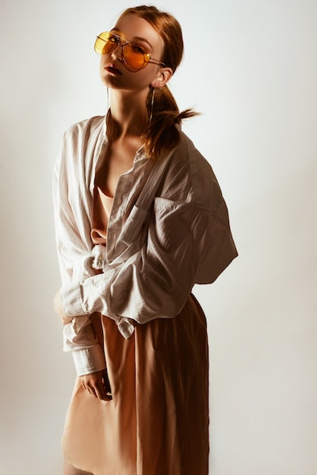

===
theme="roma"
sidebar="none"
===

#### FURNITURE 

### Your next leather sling chair?
 
They're fashionable. They're sturdy. And they're crazy comfortable.
With an energy that fits both masculine and feminine vibes, these
are the chairs you want for your office waiting room---or the rec room.

## Wood and leather are back

In a way that hasn't hit the trend world since the late 1980s, 
shaped wood chairs are drawing sharp breaths all across the
interior design world. They're graceful yet strong, elegant
yet utilitarian.

> We thought the world was ready for these chairs,
> but we really didn't know how right we were

They've been seen in the ateliers of

* Paris
* Shanghai
* And of course, Roma!

---

#### Eyewear

### We knew aviators were back, but...

This gigantic? We're honestly not sure if this was a gag on the catwalks, or a cruel prank on the model. While she'd look good in anything, we're not sure we'd have the guts to wear something like this.

