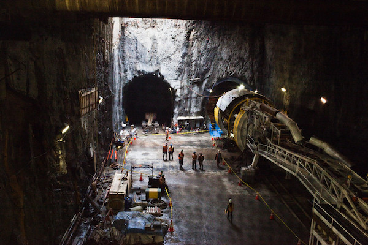

===
theme = "update"
sidebar = "right"
===

#### CITY

# Subway Milestone Met

##### File photo Courtesy **WIRED** magazine *({{ ftime "January 02" }})*

**SPRINGFIELD** One of the biggest engineering projects in the history of the state
has reached a milestone today. The juncture of lines A and K 
was opened and crews immediately began reinforcing the aging line
K. Weather concerns subsequently slowed down construction, which is already 
18 months and $270 million over budget.

[Right sidebar](index.html)
[Left sidebar](test-lside.html)

Widely considered a boondoggle by skeptics in the rigid airship industry,
line A boasts a number of improvements over its predecessor: earthquake
safety improvements, faster fire detection, and multiple points of exits
for emergency use. Line A will be fully automated, a sore point with
the Teamsters Union, which has invested over $2 million in a campaign
to improve the image of Springfield's subway drivers. That's a 
tough nut to crack, because Springfield's on-time record is dismal.
Though mayor Ian Thomas demurs, most experts insist there was no
other avenue to success.

