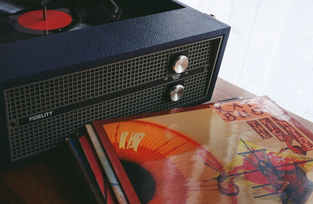

#### By Tom Campbell *| Staff reporter |* **{{ ftime "Jan 2, 2006" }}**

## Retro is Really Back, Baby

*(Dateline: Hollywoodland, CA)* Is retro really back? "With a lot of producers, it's all about analog," says Seattle producer [Mox Chelais](https://soundcloud.com/moxchehalis/tracks). "Not exclusively but it's one of the paints in my palette, for reals. I have a lot of vintage equipment because it just gives a feel you can't get any other way. God knows I've tried."

> Mox: It's all about analog

Others agree.

